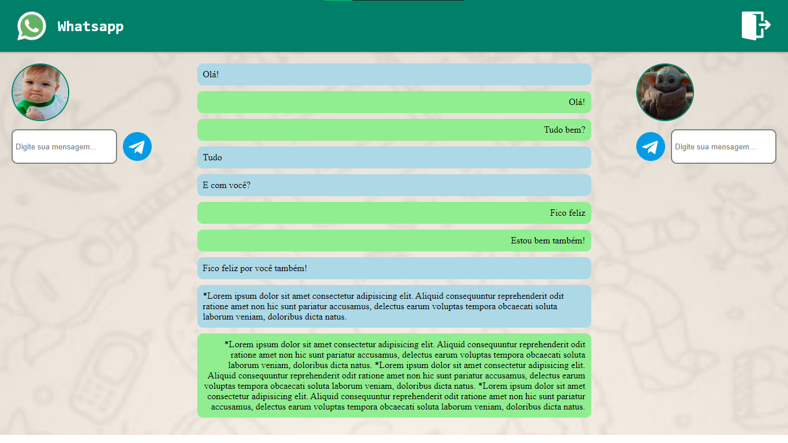

# Chat de Mensagens

## 💻 Sobre

Aplicação web de mensagens.

Treino de desenvolvimento de aplicação web com forte manipulação do DOM e tecnologias como SASS (Syntactically Awesome Style Sheets) e TS (TypeScript).

## ⭐ Conceitos e Tecnologias

- HypeText Markup Language (HTML5);
- Cascading Style Sheets (CSS3);
- Syntactically Awesome Style Sheets (SASS);
- JavaScript (JS);
- TypeScript (TS); e
- LocalStorage.

## Visualização

<a href="https://vitorsantos920.github.io/chatMessage">Visualizar Projeto Online</a>
